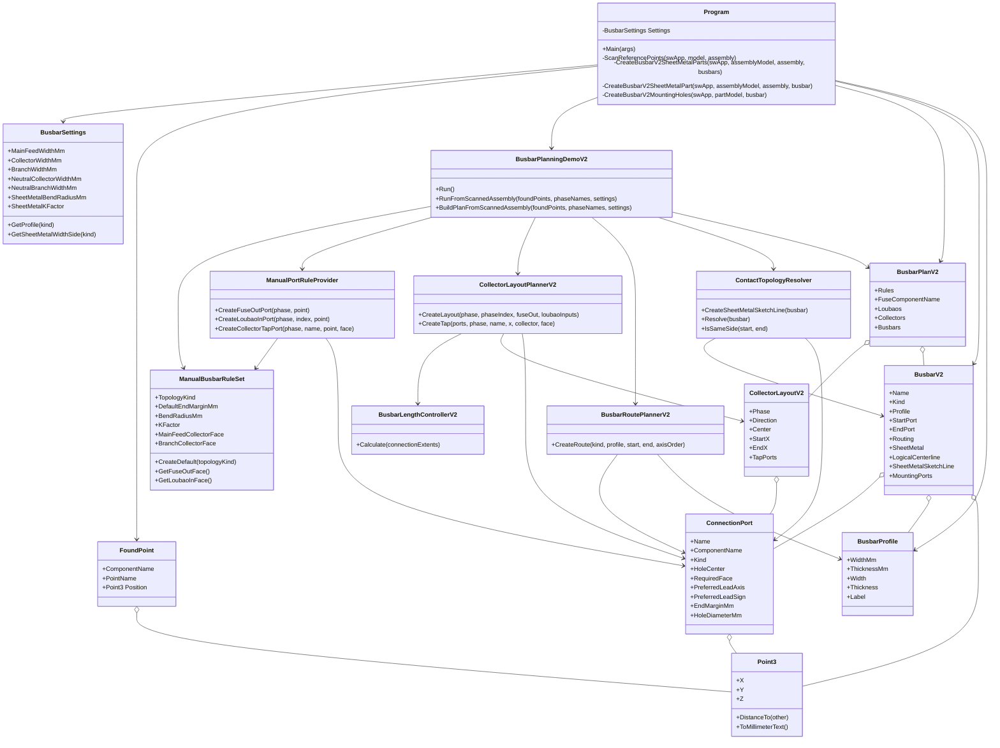

# 项目架构分析

本文档记录当前 `SWApiDesign` 仓库的真实架构状态。重点不是评价代码好坏，而是把现在已经跑通的铜排自动建模主线拆清楚，方便后续从“能跑的 Demo/工具”升级为“可扩展的配电箱铜排建模框架”。

当前结论可以先抓住三句话：

- 当前主工程是 `TopToDown`，负责连接 SolidWorks、扫描装配体、规划铜排、生成钣金零件并插回装配体。
- 当前已经形成了 V2 业务抽象，核心在 `BusbarFramework.cs`；但 SolidWorks API 操作仍集中在 `Program.cs`。
- 当前 V2 主线已经从 ABC 三相扩展到 ABC + N：ABC 负责三相转接排、汇流排和分支排，N 当前负责中性线汇流排和分支排。
- 代码同时保留了旧 V1 路线和新 V2 路线。后续应以 V2 为主线，把 V1/临时 Demo 逐步归档或删除。

## 1. 文件结构树

```text
SWApiDesign
├─ .gitattributes
├─ .gitignore
├─ README.md
├─ Architecture.md
├─ FunctionCallTree.md
├─ BusinessFlow.md
├─ RefactorProposal.md
├─ Architecture.mmd
├─ 配电箱二次开发_数据层模板.xlsx
├─ 配电箱二次开发路线图.md
├─ C#
│  ├─ TopToDown
│  │  ├─ TopToDown.slnx
│  │  ├─ ReferenceDLL
│  │  │  ├─ SolidWorks.Interop.sldworks.dll
│  │  │  ├─ SolidWorks.Interop.swconst.dll
│  │  │  ├─ SolidWorks.Interop.swpublished.dll
│  │  │  └─ solidworkstools.dll
│  │  └─ TopToDown
│  │     ├─ App.config
│  │     ├─ TopToDown.csproj
│  │     ├─ TopToDown.csproj.user
│  │     ├─ Program.cs
│  │     ├─ BusbarFramework.cs
│  │     └─ Properties
│  │        └─ AssemblyInfo.cs
│  └─ FeatureExtract
│     ├─ ReferenceDLL
│     │  ├─ SolidWorks.Interop.sldworks.dll
│     │  ├─ SolidWorks.Interop.swconst.dll
│     │  ├─ SolidWorks.Interop.swpublished.dll
│     │  └─ solidworkstools.dll
│     └─ FeatureExtract
│        ├─ App.config
│        ├─ FeatureExtract.csproj
│        ├─ Program.cs
│        └─ Properties
│           └─ AssemblyInfo.cs
├─ docs
│  ├─ BUSBAR_ARCHITECTURE.md
│  ├─ CODE_ANALYSIS.md
│  ├─ GIT_WORKFLOW.md
│  └─ PROJECT_STRUCTURE.md
└─ SWtopToDown
   ├─ Top-Down.SLDASM
   ├─ APITest.SLDASM
   ├─ 1350mountingplate.SLDPRT
   ├─ fuse24.SLDPRT
   ├─ loubao.SLDPRT
   ├─ Busbar_Skeleton.SLDPRT
   └─ Busbar_*.SLDPRT
```

说明：

- `bin/`、`obj/`、`.vs/`、`.git/` 是构建或 IDE/Git 目录，不属于架构分析主体。
- `SWtopToDown/Busbar_*.SLDPRT` 是运行时生成物，不应作为业务代码分析对象。
- `~$*.SLDPRT`、`~$*.SLDASM` 是 SolidWorks 打开文件时的锁文件，不属于源文件。

## 2. 文件夹职责

| 路径 | 当前职责 | 后续建议 |
| --- | --- | --- |
| `C#/TopToDown` | 主 SolidWorks 自动建模工程。 | 保留为应用入口工程，内部继续拆分子目录。 |
| `C#/TopToDown/TopToDown/Program.cs` | 入口、命令行参数、SW 会话、装配体扫描、V1 旧路径、V2 钣金生成、孔切除、保存、插入装配体。 | 拆成 Application、SW Adapter、SheetMetal Builder、Hole Builder、Persistence 等模块。 |
| `C#/TopToDown/TopToDown/BusbarFramework.cs` | V2 铜排业务建模核心：规则、端口、汇流排布局、长度控制、路径规划、拓扑补偿、计划构建。 | 继续拆成 Models、Rules、Planning、Topology、Compensation。 |
| `C#/TopToDown/ReferenceDLL` | SolidWorks Interop 引用。 | 可保留；长期可统一为依赖管理或共享引用目录。 |
| `C#/FeatureExtract` | 独立诊断工具，用来扫描当前 SolidWorks 文档的特征、参考点、坐标转换。 | 保留为调试工具，或抽出公共扫描逻辑复用到主工程。 |
| `docs` | 项目经验、旧分析、Git 工作流、铜排架构记录。 | 建议把稳定设计文档迁入 `docs/architecture/`，把试验日志迁入 `docs/experiments/`。 |
| `SWtopToDown` | 示例装配体、设备零件、运行生成的铜排零件。 | 源装配与生成物应分离，例如 `samples/` 与 `generated/`。 |
| 根目录 Excel/路线图 | 早期数据层和开发路线材料。 | 后续数据驱动时，可转为配置文件或导入器。 |

## 3. 核心文件职责

### `Program.cs`

当前是一个“应用入口 + SolidWorks API 操作集合 + 旧业务逻辑集合”的巨石类。

主要职责：

- 解析命令行参数，例如 `--sheetmetal-v2-all`、`--preview-v2-assembly`、`--plan-v2-assembly`。
- 连接或启动 SolidWorks。
- 获取当前活动装配体。
- 扫描装配体和组件里的命名参考点。
- 删除旧的 `Busbar_` 组件。
- 调用 V2 规划器生成 `BusbarPlanV2`。
- 批量生成 V2 钣金零件。
- 创建开放轮廓 2D 草图。
- 调用 `InsertSheetMetalBaseFlange2` 生成钣金基体法兰。
- 调用 `FeatureCut4` 创建安装孔。
- 保存 `SLDPRT` 并插入回装配体。
- 保留旧 V1 路线和试验 Demo 入口。

### `BusbarFramework.cs`

当前是 V2 铜排业务框架的核心，已经比旧逻辑清晰很多。

主要职责：

- 定义工程场景、接触面、拓扑关系、路径规则、端口类型等枚举。
- 定义 `ConnectionPort`、`BusbarV2`、`CollectorLayoutV2`、`BusbarPlanV2` 等业务模型。
- 用 `ManualBusbarRuleSet` 描述手动规则初版。
- 用 `ManualPortRuleProvider` 把扫描点转换为有语义的连接端口。
- 用 `CollectorLayoutPlannerV2` 计算汇流排位置和 Tap 点。
- 用 `BusbarLengthControllerV2` 根据实际搭接范围计算汇流排长度。
- 用 `BusbarRoutePlannerV2` 生成转接排/分支排逻辑路径。
- 用 `ContactTopologyResolver` 判断同侧/异侧并生成最终钣金草图线。
- 用 `BusbarPlanningDemoV2` 从扫描点构建完整 V2 计划。

### `FeatureExtract/Program.cs`

独立诊断工具，不参与生成铜排。

主要职责：

- 连接正在运行的 SolidWorks。
- 打印当前文档类型、标题、路径。
- 扫描零件或装配体 Feature 树。
- 重点输出 `RefPoint`、`CoordSys`、`RefPlane`、`RefAxis`。
- 对装配体组件使用 `Transform2` 把局部坐标转换到装配体坐标。

## 4. 当前逻辑分层

当前代码已经有“事实上的层”，但没有通过目录/接口明确分开。

```text
Application / CLI Layer
├─ Main
├─ ConfigureFromArgs
└─ 运行模式分支

SolidWorks Session Layer
├─ GetOrStartSolidWorks
├─ GetActiveOrOpenAssembly
├─ ActivateDocument
└─ CloseBusbarPartDocument

Assembly Scan Layer
├─ ScanReferencePoints
├─ DumpModelFeatures
├─ TryReadReferencePoint
└─ TransformPoint

V2 Planning Layer
├─ ManualBusbarRuleSet
├─ ManualPortRuleProvider
├─ CollectorLayoutPlannerV2
├─ BusbarLengthControllerV2
├─ BusbarRoutePlannerV2
├─ ContactTopologyResolver
└─ BusbarPlanningDemoV2.BuildPlanFromScannedAssembly

Geometry / Sheet Metal Layer
├─ CreateBusbarV2SheetMetalPart
├─ CreateBusbarV2SheetMetalFeature
├─ CreateV2SheetMetalOpenProfileSketch
├─ CreateSheetMetalBaseFlangeFromSelectedSketch
├─ GetSheetMetalBaseFlangeExtent
└─ ApplySheetMetalParametersToCreatedFeature

Hole Builder Layer
├─ CreateBusbarV2MountingHoles
├─ CreateBusbarV2MountingHole
├─ GetHoleSketchPlane
├─ CreateDirectedBlindCutFromActiveSketch
└─ FeatureCut4 调用族

Persistence / Assembly Insert Layer
├─ SaveBusbarV2SheetMetalPart
├─ SaveDemoBusbarPart
├─ SaveBusbarPart
├─ InsertDemoPartIntoAssembly
└─ InsertBusbarPartIntoAssembly
```

## 5. 核心类和职责

| 类/枚举 | 所属文件 | 类型 | 职责 | 主要依赖 |
| --- | --- | --- | --- | --- |
| `Program` | `Program.cs` | 应用/SW API | 主入口、SW 调用、生成流程编排。 | SolidWorks Interop、V2 框架模型。 |
| `BusbarSettings` | `Program.cs` | 配置模型 | 铜排宽厚、N 排独立规格、汇流排间距、钣金参数、搭接参数。 | `BusbarProfile`、枚举。 |
| `FoundPoint` | `Program.cs` | 数据模型 | 保存扫描到的参考点，坐标统一为装配体坐标。 | `Point3`。 |
| `Point3` | `Program.cs` | 几何模型 | 三维坐标，内部单位为米，显示转换为毫米。 | 无。 |
| `BusbarProfile` | `Program.cs` | 数据模型 | 铜排宽度、厚度、标签和单位转换。 | 无。 |
| `BusbarRoute` | `Program.cs` | V1 数据模型 | 旧路线模型，保存中心线点。 | `BusbarProfile`、`Point3`。 |
| `SheetMetalOpenProfilePlane` | `Program.cs` | SW 几何辅助模型 | 描述开放轮廓草图所在偏移平面。 | `AxisDirection`。 |
| `SheetMetalBaseFlangeExtent` | `Program.cs` | SW API 参数模型 | 封装基体法兰宽度方向、终止条件、Mid Plane 参数。 | `swEndConditions_e`。 |
| `ManualBusbarRuleSet` | `BusbarFramework.cs` | 规则模型 | 手动规则初版，定义结构类型、默认面、孔径、裕度、K 因子。 | `CabinetTopologyKind`、`ContactFace`。 |
| `SheetMetalOptions` | `BusbarFramework.cs` | 数据模型 | 单根铜排的钣金参数。 | `ManualBusbarRuleSet`。 |
| `BusbarRoutingOptions` | `BusbarFramework.cs` | 数据模型 | 单根铜排路径轴顺序和厚度转换策略。 | `RouteAxisOrder`、`ThicknessTransitionPolicy`。 |
| `ConnectionPort` | `BusbarFramework.cs` | 业务数据模型 | 连接端口，含孔中心、连接面、引出方向、端部预留、孔径。 | `Point3`、`ContactFace`。 |
| `BusbarV2` | `BusbarFramework.cs` | 核心业务模型 | 一根 V2 铜排，含起终端口、逻辑中心线、钣金草图线、安装孔。 | `ConnectionPort`、`BusbarProfile`。 |
| `CollectorLayoutV2` | `BusbarFramework.cs` | 业务模型 | 单相汇流排位置、起止 X、Tap 端口集合。 | `ConnectionPort`。 |
| `BusbarPlanV2` | `BusbarFramework.cs` | 规划结果模型 | 一次装配体规划的总输出：规则、设备组、汇流排、铜排列表。 | `BusbarV2`、`CollectorLayoutV2`。 |
| `ManualPortRuleProvider` | `BusbarFramework.cs` | 规则/转换器 | 把扫描点转换为设备端口或汇流排 Tap 端口。 | `ManualBusbarRuleSet`。 |
| `CollectorLayoutPlannerV2` | `BusbarFramework.cs` | 业务规划器 | 计算 ABC/N 汇流排位置、长度范围和 Tap 点。 | `BusbarLengthControllerV2`、`BusbarSettings`。 |
| `BusbarLengthControllerV2` | `BusbarFramework.cs` | 业务规划器 | 根据所有连接铜排的 X 向占用范围计算汇流排起止点。 | `CollectorConnectionExtentV2`、`BusbarSettings`。 |
| `BusbarRoutePlannerV2` | `BusbarFramework.cs` | 路径规划器 | 生成转接排和普通两轴折线路径。 | `BusbarSettings`。 |
| `ContactTopologyResolver` | `BusbarFramework.cs` | 拓扑/补偿器 | 判断同侧/异侧，增加端部裕度，生成钣金草图线。 | `BusbarV2`、`ConnectionPort`。 |
| `BusbarPlanningDemoV2` | `BusbarFramework.cs` | 应用服务/编排器 | 从扫描点构建 V2 计划，打印规划结果。 | 所有 V2 规划类。 |
| `LoubaoGroupV2` | `BusbarFramework.cs` | 数据模型 | 一个漏保组件及其中心 X。 | 无。 |
| `FeatureExtract.Program` | `FeatureExtract/Program.cs` | 诊断工具 | 扫描 SW 文档特征和坐标。 | SolidWorks Interop。 |

## 6. 类关系 Mermaid 图



## 7. 类的类别归属

### 业务逻辑类

- `ManualBusbarRuleSet`
- `ManualPortRuleProvider`
- `CollectorLayoutPlannerV2`
- `BusbarLengthControllerV2`
- `BusbarRoutePlannerV2`
- `ContactTopologyResolver`
- `BusbarPlanningDemoV2`

这些类描述的是“配电箱铜排应该怎么连、怎么走、怎么搭接”，理论上不应该依赖 SolidWorks API。当前它们基本满足这一点，但仍依赖定义在 `Program.cs` 里的 `BusbarSettings`、`BusbarProfile`、`Point3`、`BusbarKind` 等模型。

### SolidWorks API 封装类/函数

目前没有独立类，主要散落在 `Program.cs` 函数中：

- `GetOrStartSolidWorks`
- `GetActiveOrOpenAssembly`
- `ScanReferencePoints`
- `DumpModelFeatures`
- `TryReadReferencePoint`
- `TransformPoint`
- `NewPartDocument`
- `CreateOffsetPlane`
- `CreateV2SheetMetalOpenProfileSketch`
- `CreateSheetMetalBaseFlangeFromSelectedSketch`
- `CreateBusbarV2MountingHole`
- `CreateDirectedBlindCutFromActiveSketch`
- `SaveBusbarV2SheetMetalPart`
- `InsertDemoPartIntoAssembly`
- `CloseBusbarPartDocument`

后续应将这些函数迁移到专门的 SW Adapter/Builder 类中。

### 数据模型类

- `FoundPoint`
- `Point3`
- `BusbarProfile`
- `ConnectionPort`
- `BusbarV2`
- `CollectorLayoutV2`
- `BusbarPlanV2`
- `LoubaoGroupV2`
- `SheetMetalOptions`
- `BusbarRoutingOptions`
- `CollectorConnectionExtentV2`
- `CollectorLengthRangeV2`
- `SheetMetalOpenProfilePlane`
- `SheetMetalBaseFlangeExtent`

其中 `SheetMetalOpenProfilePlane` 和 `SheetMetalBaseFlangeExtent` 更偏 SW 建模参数模型，不应和纯业务模型混在一起。

## 8. 当前主要架构问题概览

- `Program.cs` 职责过多，同时承担入口、扫描、业务兼容、钣金、打孔、保存、装配插入。
- V1 和 V2 逻辑共存在同一个类里，读代码时容易误判当前主线。
- `BusbarFramework.cs` 已经抽出了 V2 业务层，但仍引用 `Program.cs` 里的基础模型和配置。
- `ContactTopologyResolver` 同时做了拓扑判断、端部裕度、厚度补偿，职责还可以继续拆。
- 保存/插入函数名仍有 `Demo`，但在 V2 主流程中已经用于正式生成，命名会误导后续维护。
- 手动规则仍硬编码在 `ManualBusbarRuleSet.CreateDefault`，还没有外部配置入口。

## 9. 当前可认为稳定的设计经验

- 铜排统一采用 `2D 开放轮廓中心线 + Sheet Metal Base Flange`。
- 宽度方向用 SolidWorks 真正的 `Mid Plane`，不是用两侧 Blind 深度模拟。
- 当前正确语义是 `Dist1 = Width`、`Dist2 = 0`、`EndCondition1 = swEndCondMidPlane`。
- 孔中心来自 `ConnectionPort.HoleCenter`，不要由零件原点猜测。
- 孔切除优先采用“进入草图、画圆、保持活动草图立即 FeatureCut4”的流程。
- 同侧/异侧是底层拓扑概念，补偿只是它的一个建模结果。
- 汇流排长度应由所有连接铜排的 X 向占用范围决定，不能写死固定长度。
- N 不并入 `PhaseNames`，而是在 ABC 主流程后追加 `N Collector` 和 `N Branch`，避免误触发刀熔三相 OUT 逻辑。
- N 排规格应独立配置，当前 `N Collector = 6x60mm`、`N Branch = 4x40mm`；后续可增加标准校核或自动选型。
- 当前 `--sheetmetal-v2-all` 已验证生成 `19` 根铜排：`3 MainFeed + 4 Collector + 12 Branch`。
