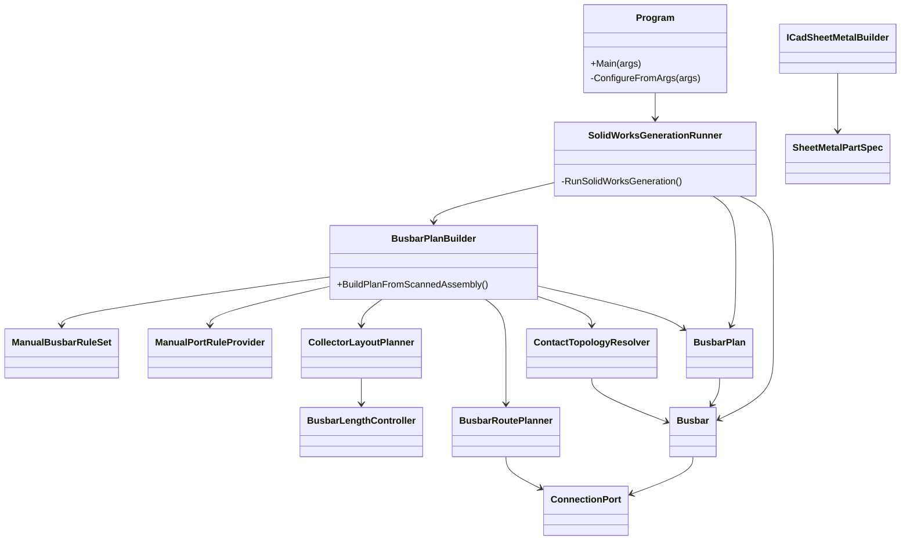

# 项目架构分析

本文档记录当前 `SWApiDesign` 的真实代码结构。主工程已经从两个大源码文件拆成按职责组织的分层目录，目标是保护业务规则、数据层和未来 UI，使 SolidWorks API 像嵌入式项目里的硬件适配层一样被隔离。

## 1. 文件结构树

```text
SWApiDesign
├─ README.md
├─ Architecture.md
├─ BusinessFlow.md
├─ FunctionCallTree.md
├─ RefactorProposal.md
├─ Architecture.mmd
├─ 数据层.xlsx
├─ C#
│  ├─ TopToDown
│  │  ├─ TopToDown.slnx
│  │  └─ TopToDown
│  │     ├─ Program.cs
│  │     ├─ App
│  │     │  └─ ProgramUtilities.cs
│  │     ├─ CadAbstractions
│  │     │  ├─ CadPartSpecs.cs
│  │     │  └─ ICadSheetMetalBuilder.cs
│  │     ├─ Domain
│  │     │  ├─ BusbarGenerationSettings.cs
│  │     │  ├─ BusbarModels.cs
│  │     │  ├─ BusbarProfile.cs
│  │     │  ├─ Enums.cs
│  │     │  ├─ FoundPoint.cs
│  │     │  ├─ LoubaoGroup.cs
│  │     │  ├─ Point3.cs
│  │     │  ├─ SheetMetalBaseFlangeExtent.cs
│  │     │  └─ SheetMetalOpenProfilePlane.cs
│  │     ├─ Planning
│  │     │  ├─ BusbarPlanBuilder.cs
│  │     │  ├─ BusbarRoutePlanner.cs
│  │     │  ├─ CollectorLayoutPlanner.cs
│  │     │  └─ ContactTopologyResolver.cs
│  │     ├─ Rules
│  │     │  ├─ ManualBusbarRuleSet.cs
│  │     │  └─ ManualPortRuleProvider.cs
│  │     ├─ SolidWorks
│  │     │  ├─ SolidWorksGenerationRunner.cs
│  │     │  ├─ SolidWorksSession.cs
│  │     │  ├─ AssemblyScanner.cs
│  │     │  ├─ PreviewBuilder.cs
│  │     │  ├─ BusbarBatchBuilder.cs
│  │     │  ├─ SheetMetalFeatureBuilder.cs
│  │     │  ├─ SheetMetalSketchBuilder.cs
│  │     │  ├─ MountingHoleBuilder.cs
│  │     │  ├─ CadGeometryUtilities.cs
│  │     │  └─ PartPersistenceService.cs
│  │     ├─ TopToDown.csproj
│  │     └─ Properties/AssemblyInfo.cs
│  └─ FeatureExtract
│     └─ FeatureExtract/Program.cs
├─ docs
│  ├─ BUSBAR_ARCHITECTURE.md
│  ├─ CODE_ANALYSIS.md
│  ├─ GIT_WORKFLOW.md
│  └─ PROJECT_STRUCTURE.md
└─ SWtopToDown
   ├─ APITest.SLDASM
   ├─ Top-Down.SLDASM
   ├─ fuse24.SLDPRT
   └─ loubao.SLDPRT
```

## 2. 分层职责

| 层 | 位置 | 职责 | 是否依赖 SolidWorks |
| --- | --- | --- | --- |
| 应用入口 | `Program.cs`、`App` | 默认参数、命令行参数、异常边界 | 否 |
| CAD 抽象 | `CadAbstractions` | CAD 中立的零件规格、孔规格、后端接口雏形 | 否 |
| 领域模型 | `Domain` | 点、端口、铜排、规格、计划对象、枚举 | 否 |
| 规则层 | `Rules` | 当前典设规则、端口生成规则 | 否 |
| 规划层 | `Planning` | 设备识别、汇流排布局、路径、拓扑补偿、计划构建 | 否 |
| SolidWorks 适配层 | `SolidWorks` | SW 会话、装配扫描、草图、钣金、打孔、保存、装配插入 | 是 |
| 诊断工具 | `C#/FeatureExtract` | 独立扫描 SW 特征和参考点 | 是 |

## 3. 当前依赖方向

```text
Program
  -> SolidWorksGenerationRunner
      -> SolidWorks API
      -> Planning
          -> Rules
          -> Domain
      -> Domain

CadAbstractions
  -> Domain
```

约束目标：

- 业务模型、规则、规划不认识 `ModelDoc2`、`Feature`、`SketchManager` 等 SolidWorks 类型。
- SolidWorks 层可以依赖业务层，把 `BusbarPlan` 和 `Busbar` 渲染为 SW 钣金零件。
- 后续如果新增 UG/NXOpen 后端，应新增 `CadNx` 或类似目录，而不是改写业务规则。

## 4. 核心类关系


```mermaid
classDiagram
    class Program {
        +Main(args)
        -ConfigureFromArgs(args)
    }

    class SolidWorksGenerationRunner {
        -RunSolidWorksGeneration()
    }

    class BusbarPlanBuilder {
        +BuildPlanFromScannedAssembly()
    }

    class ManualBusbarRuleSet
    class ManualPortRuleProvider
    class CollectorLayoutPlanner
    class BusbarLengthController
    class BusbarRoutePlanner
    class ContactTopologyResolver
    class BusbarPlan
    class Busbar
    class ConnectionPort
    class SheetMetalPartSpec
    class ICadSheetMetalBuilder

    Program --> SolidWorksGenerationRunner
    SolidWorksGenerationRunner --> BusbarPlanBuilder
    SolidWorksGenerationRunner --> BusbarPlan
    SolidWorksGenerationRunner --> Busbar

    BusbarPlanBuilder --> ManualBusbarRuleSet
    BusbarPlanBuilder --> ManualPortRuleProvider
    BusbarPlanBuilder --> CollectorLayoutPlanner
    BusbarPlanBuilder --> BusbarRoutePlanner
    BusbarPlanBuilder --> ContactTopologyResolver
    BusbarPlanBuilder --> BusbarPlan

    CollectorLayoutPlanner --> BusbarLengthController
    BusbarRoutePlanner --> ConnectionPort
    ContactTopologyResolver --> Busbar
    BusbarPlan --> Busbar
    Busbar --> ConnectionPort
    ICadSheetMetalBuilder --> SheetMetalPartSpec
```

## 5. 当前耦合点

- `SolidWorks` 层目前仍以 `partial Program` 承载，是第一轮拆分后的过渡形态；后续可继续收敛成独立服务类。
- `BusbarSettings` 仍在 `Program.cs` 中初始化，后续应迁移到 `GenerationOptions`、UI 输入或数据层。
- 折弯半径、孔径、搭接规则目前仍是默认规则，后续应抽出 `BendRadiusRules`、`HoleLayoutPlanner`、`BusbarLapJointRules`、`FastenerRules`。
- `CadAbstractions` 已有接口雏形，但当前生成流程尚未通过该接口运行。

## 6. 当前结论

当前项目已经进入“业务规则与 CAD 适配分离”的第一阶段。下一步应优先把固定参数和孔位规则从默认代码迁出，再接入 `数据层.xlsx`，最后把 SolidWorks 层从 `partial Program` 继续收敛成真正的 CAD 后端实现。
