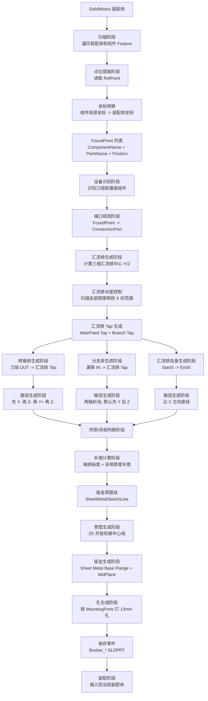

# 业务流程分析

本文档不从代码细节出发，而从配电箱铜排自动建模业务流程出发，说明当前程序如何从装配体里的命名参考点，生成三相转接排、汇流排、分支排，并插回 SolidWorks 装配体。

当前主业务目标：

```text
读取装配体
-> 找到刀熔 OUT 和漏保 IN 点
-> 生成汇流排位置和长度
-> 建立每根铜排的起终端口
-> 判断同侧/异侧拓扑
-> 生成带端部裕度和补偿的钣金中心线
-> 用 2D 开放轮廓 + Sheet Metal MidPlane 生成实体
-> 按孔中心打孔
-> 保存零件并插回装配体
```

## 1. 总体业务流程

```text
装配体
↓
扫描特征
↓
提取连接点
↓
识别设备和相序
↓
生成端口对象
↓
确定汇流排布局
↓
计算汇流排长度
↓
生成连接关系
↓
拓扑判断：同侧 / 异侧
↓
补偿计算：端部裕度 + 厚度转换
↓
路径规划：逻辑中心线 -> 钣金草图线
↓
草图生成：2D 开放轮廓
↓
钣金生成：Sheet Metal Base Flange MidPlane
↓
孔生成：按端口 HoleCenter 打孔
↓
保存零件
↓
装配插入
```

## 2. 每一步输入、输出和负责函数

| 阶段 | 业务含义 | 输入 | 输出 | 当前负责函数 |
| --- | --- | --- | --- | --- |
| 装配体读取 | 获取当前要处理的 SolidWorks 装配体。 | SolidWorks 会话。 | `ModelDoc2` 装配体、`AssemblyDoc`。 | `GetOrStartSolidWorks`、`GetActiveOrOpenAssembly` |
| 扫描阶段 | 遍历装配体和组件 Feature 树。 | 装配体、组件列表。 | Feature 流。 | `ScanReferencePoints`、`DumpModelFeatures` |
| 点位提取阶段 | 读取命名参考点并转为装配体坐标。 | `RefPoint` Feature、组件 `Transform2`。 | `FoundPoint(ComponentName, PointName, Position)`。 | `TryReadReferencePoint`、`TransformPoint` |
| 设备识别阶段 | 判断哪个组件是刀熔、哪些是漏保。 | 所有 `FoundPoint`。 | `FuseComponentName`、`LoubaoGroupV2`。 | `FindFuseComponent`、`FindLoubaoGroups` |
| 端口生成阶段 | 把点变成有工程语义的连接端口。 | `FoundPoint`、手动规则。 | `ConnectionPort`。 | `ManualPortRuleProvider.CreateFuseOutPort`、`CreateLoubaoInPort`、`CreateCollectorTapPort` |
| 汇流排位置阶段 | 计算每相汇流排中心 Y/Z 和方向。 | 漏保 IN 点、相序、设置参数。 | `CollectorLayoutV2.Center`。 | `CollectorLayoutPlannerV2.CreateLayout` |
| 汇流排长度阶段 | 根据所有搭接铜排决定 X 起止范围。 | 刀熔端口、漏保端口、对应铜排宽度。 | `StartX`、`EndX`。 | `BusbarLengthControllerV2.Calculate` |
| 汇流排 Tap 阶段 | 在汇流排上创建转接排/分支排连接点。 | 设备端口 X、汇流排中心、搭接面。 | `CollectorTap` 端口。 | `CollectorLayoutPlannerV2.CreateTap` |
| 连接关系阶段 | 建立每根铜排的起点和终点。 | 设备端口、Tap 端口。 | `BusbarV2.StartPort`、`EndPort`。 | `BusbarPlanningDemoV2.CreateBusbar`、`CreateCollectorBusbar` |
| 拓扑判断阶段 | 判断连接两端属于同侧还是异侧。 | 铜排类型、起终端口连接面、工程场景。 | `ContactTopologyKind`。 | `ContactTopologyResolver.Resolve` |
| 路径规划阶段 | 生成孔中心意义上的业务路径。 | 起点端口、终点端口、路径规则。 | `LogicalCenterline`。 | `BusbarRoutePlannerV2.CreateRoute` |
| 补偿计算阶段 | 加端部裕度，异侧时做厚度转换。 | `LogicalCenterline`、端口裕度、拓扑关系、铜排厚度。 | `SheetMetalSketchLine`。 | `ContactTopologyResolver.CreateSheetMetalSketchLine` |
| 草图平面阶段 | 判断路径所在 2D 平面。 | `SheetMetalSketchLine`。 | `SheetMetalOpenProfilePlane`。 | `GetOpenProfilePlane` |
| 草图生成阶段 | 在零件内画 2D 开放轮廓中心线。 | 草图线点、草图平面。 | Sketch Feature。 | `CreateV2SheetMetalOpenProfileSketch` |
| 钣金生成阶段 | 通过开放线生成钣金铜排。 | Sketch、宽度、厚度、R、K。 | Sheet Metal Feature。 | `CreateSheetMetalBaseFlangeFromSelectedSketch`、`ApplySheetMetalParametersToCreatedFeature` |
| 孔生成阶段 | 在每个端口孔中心创建安装孔。 | `MountingPorts`、孔径、孔中心、连接面。 | Cut Feature。 | `CreateBusbarV2MountingHoles`、`CreateBusbarV2MountingHole` |
| 保存阶段 | 将生成铜排保存为零件文件。 | 零件文档、装配路径、铜排名。 | `SLDPRT` 文件路径。 | `SaveBusbarV2SheetMetalPart` |
| 装配阶段 | 将零件插入装配体。 | 零件路径、装配体。 | 装配体中新增组件。 | `InsertDemoPartIntoAssembly` |

## 3. Mermaid 业务流程图



## 4. 业务对象流转

### 4.1 从扫描点到端口

```text
RefPoint Feature
-> 本地坐标 Point3
-> 如果属于组件，乘以 Component.Transform2
-> 装配体坐标 FoundPoint
-> 根据点名和组件类型生成 ConnectionPort
```

关键语义：

- `FoundPoint.Position` 已经是装配体坐标，不再是零件局部坐标。
- `ConnectionPort.HoleCenter` 表示连接面上的孔中心。
- `ConnectionPort.RequiredFace` 表示铜排需要贴合哪一面，例如 `Front/Back/Upper/Lower`。
- `ConnectionPort.EndMarginMm` 表示孔中心到铜排端部外伸长度。
- `ConnectionPort.HoleDiameterMm` 表示该端口是否需要打孔，以及孔径。

### 4.2 从端口到铜排

```text
StartPort + EndPort + Profile + RoutingOptions + SheetMetalOptions
-> BusbarV2
```

`BusbarV2` 中有两条线：

- `LogicalCenterline`：业务逻辑线，经过连接孔中心和搭接点。
- `SheetMetalSketchLine`：最终给 SolidWorks 画开放轮廓的线，包含端部裕度和必要的厚度补偿。

这个区分非常重要。以后业务路径规划只应该产出 `LogicalCenterline`，不要在路径规划阶段偷偷做钣金补偿。

## 5. 汇流排生成流程

### 输入

- 每相刀熔 OUT 点。
- 每相所有漏保 IN 点。
- 铜排规格：转接排宽度、分支排宽度、汇流排宽度。
- 设置参数：相间距、顶部间隙、Z 向偏移、X- 方向外伸量。

### 输出

- `CollectorLayoutV2`：每相一个。
- 每个 Collector 包含：`Center`、`StartX`、`EndX`、`TapPorts`。
- 三根汇流排 `BusbarV2`。

### 当前规则

```text
collectorY = max(loubao IN Y) + CollectorTopClearanceY - phaseIndex * CollectorPhaseSpacing
collectorZ = average(loubao IN Z) + CollectorOffsetFromLoubaoInZ
```

长度规则：

```text
positiveXLimit = max(connection.CenterX + connection.HalfSpanX)
negativeXLimit = min(connection.CenterX - connection.HalfSpanX)
StartX = negativeXLimit - CollectorNegativeXExtend
EndX = positiveXLimit
```

其中：

- 转接排连接范围用 `MainFeedProfile.Width / 2`。
- 分支排连接范围用 `BranchProfile.Width / 2`。
- X+ 侧不额外外伸，但会覆盖最外侧铜排半宽，避免孔半露在外面。
- X- 侧在最外侧连接铜排外边界后继续外伸 50mm。

### 负责函数

- `CollectorLayoutPlannerV2.CreateLayout`
- `CollectorLayoutPlannerV2.CreateConnectionExtents`
- `BusbarLengthControllerV2.Calculate`
- `CollectorLayoutPlannerV2.CreateTap`
- `BusbarPlanningDemoV2.CreateCollectorBusbar`

## 6. 转接排生成流程

### 输入

- 刀熔 `A_OUT/B_OUT/C_OUT` 端口。
- 对应相汇流排 `MainFeed Tap`。
- 转接排规格，当前默认 `6x60mm`。
- 手动规则：典设箱、汇流排上搭、刀熔 OUT 贴 `Back/Z+`。

### 输出

- 三根转接排 `Busbar_A_MainFeed_V2`、`Busbar_B_MainFeed_V2`、`Busbar_C_MainFeed_V2`。
- 每根包含逻辑路径、钣金草图线和两个安装孔端口。

### 当前路径规则

```text
P0 = 刀熔 OUT 孔中心
P1 = P0 沿 Y- 引出 MainLeadOutY
P2 = P1 沿 Z- 到 ApproachZ
P3 = P2 沿 Y+ 到汇流排 Tap 的 Y
P4 = 汇流排 Tap 孔中心
```

当前 `ApproachZ` 的简单规则：

```text
在汇流排外侧完成长距离 Y 向移动
偏移量 = CollectorWidth / 2 + MainFeedWidth / 2 + MainCollectorFrontClearance
```

这两个决策点已经留有函数接口：

- `CalculateMainFeedLeadOutY`
- `CalculateMainFeedApproachZ`
- `CalculateMainFeedApproachOffsetZ`

后续可以替换为基于设备包络、最小折弯长度和避让空间的自动计算。

### 拓扑与补偿

在当前典设箱场景中：

```text
刀熔与漏保分别位于汇流排两侧
转接排搭接在汇流排 Upper
=> DifferentSide
=> 需要厚度补偿
```

当前默认补偿策略：

- `TransitionPolicy = Auto` 时实际等同于优先补偿终点，即汇流排端。
- 补偿量为当前铜排厚度。
- 补偿方向由 `RequiredFace` 和局部路径语义决定，目前主要由 `ChooseThicknessNormal` 实现。

### 负责函数

- `ManualPortRuleProvider.CreateFuseOutPort`
- `CollectorLayoutPlannerV2.CreateTap`
- `ApplyMainFeedCollectorTapRules`
- `BusbarRoutePlannerV2.CreateMainFeedRoute`
- `ContactTopologyResolver.ResolveMainFeedTopology`
- `ContactTopologyResolver.ApplyThicknessTransition`

## 7. 分支排生成流程

### 输入

- 每个漏保的 `A_IN/B_IN/C_IN` 端口。
- 对应相汇流排 `Branch Tap`。
- 分支排规格，当前默认 `4x40mm`。

### 输出

- 九根分支排，每相三根。
- 每根包含起点孔、汇流排端孔。

### 当前路径规则

默认先 Y 后 Z：

```text
P0 = 漏保 IN 孔中心
P1 = (P0.X, Tap.Y, P0.Z)
P2 = (P0.X, Tap.Y, Tap.Z)
```

### 拓扑与补偿

当前分支排按 `SameSide` 处理，因此不会执行异侧厚度补偿。它能正确生成不能证明补偿逻辑一定正确，只能说明当前分支排场景不需要异侧补偿。

### 负责函数

- `ManualPortRuleProvider.CreateLoubaoInPort`
- `ApplyBranchDevicePortRules`
- `CollectorLayoutPlannerV2.CreateTap`
- `ApplyBranchCollectorTapRules`
- `BusbarRoutePlannerV2.CreateSimpleRoute`
- `ContactTopologyResolver.CreateSheetMetalSketchLine`

## 8. 汇流排自身生成流程

### 输入

- `CollectorLayoutV2.StartX`
- `CollectorLayoutV2.EndX`
- `CollectorLayoutV2.Center.Y/Z`
- 汇流排 TapPorts。

### 输出

- 三根汇流排 `Busbar_A_Collector_V2`、`Busbar_B_Collector_V2`、`Busbar_C_Collector_V2`。
- 汇流排上包含所有 Tap 孔。

### 当前路径规则

```text
P0 = (StartX, Center.Y, Center.Z)
P1 = (EndX, Center.Y, Center.Z)
```

### 孔规则

汇流排的 `MountingPorts` 来自 `collector.TapPorts`，也就是所有转接排和分支排连接点。当前 Tap 孔径由 `ApplyCollectorTapHoleRules` 设置为默认 13mm。

### 负责函数

- `BusbarLengthControllerV2.Calculate`
- `BusbarPlanningDemoV2.CreateCollectorBusbar`
- `ApplyCollectorTapHoleRules`

## 9. 同侧/异侧判断阶段

### 业务含义

同侧/异侧不是“是否补偿”的别名，而是更底层的工程拓扑关系。

推荐理解链路：

```text
工程场景
-> 同侧/异侧拓扑判断
-> 补偿策略
-> 最终建模点位
```

不要把逻辑理解成：

```text
工程场景
-> 直接补偿
```

因为未来切换南网结构、改变搭接面、增加新铜排类型时，同侧/异侧仍然是可复用概念。

### 当前转接排规则表

| 场景 | 汇流排搭接面 | 拓扑 | 当前建模处理 |
| --- | --- | --- | --- |
| 刀熔和漏保在汇流排两侧 | Upper | DifferentSide | 需要补偿 |
| 刀熔和漏保在汇流排两侧 | Lower | SameSide | 不补偿 |
| 刀熔和漏保在汇流排同侧 | Upper | SameSide | 不补偿 |
| 刀熔和漏保在汇流排同侧 | Lower | DifferentSide | 需要补偿 |

当前代码中，这些规则主要落在 `ContactTopologyResolver.ResolveMainFeedTopology`。

## 10. 补偿计算阶段

补偿阶段分两步：

### 10.1 端部裕度

业务语义：连接点是孔中心，不是铜排端部。所以草图线要在孔中心外继续延长一段。

```text
startEnd = route[0] - startDirection * StartPort.EndMargin
endEnd = route[last] + endDirection * EndPort.EndMargin
```

负责函数：`ContactTopologyResolver.AddEndMargins`。

### 10.2 异侧厚度补偿

业务语义：如果两端是异侧搭接，仅靠 MidPlane 解决不了厚度方向穿模，需要把某一端的草图线移动一个厚度。

当前 V0 策略：

```text
if topology == SameSide:
    不做厚度转换
else:
    默认补偿 EndPort
    offset = normal * busbar.Profile.Thickness
    移动终点附近一段共线点
```

负责函数：

- `ContactTopologyResolver.ApplyThicknessTransition`
- `ContactTopologyResolver.ShouldCompensateStart`
- `ContactTopologyResolver.ChooseThicknessNormal`
- `ContactTopologyResolver.MoveEndpointRun`

## 11. 钣金生成阶段

### 输入

- `SheetMetalSketchLine`
- 铜排规格：宽度、厚度。
- 钣金参数：折弯半径、K 因子、MidPlane。

### 输出

- SolidWorks Sheet Metal Feature。

### 当前建模方式

```text
创建零件
-> 创建偏移平面
-> 在 2D 草图中画开放折线
-> 选择草图
-> InsertSheetMetalBaseFlange2
-> 设置 SheetMetal Feature 参数
```

当前关键经验：

```text
Dist1 = Width
Dist2 = 0
EndCondition1 = swEndCondMidPlane
EndCondition2 = swEndCondBlind
```

不要使用：

```text
Dist1 = Width / 2
Dist2 = Width / 2
EndCondition1 = Blind
EndCondition2 = Blind
```

这不是 SolidWorks UI 中真正的“两侧对称”。

负责函数：

- `CreateBusbarV2SheetMetalFeature`
- `CreateV2SheetMetalOpenProfileSketch`
- `CreateSheetMetalBaseFlangeFromSelectedSketch`
- `GetSheetMetalBaseFlangeExtent`
- `ApplySheetMetalParametersToCreatedFeature`

## 12. 孔生成阶段

### 输入

- `BusbarV2.MountingPorts`
- 每个端口的 `HoleCenter`
- 每个端口的 `RequiredFace`
- 每个端口的 `HoleDiameterMm`
- 铜排厚度。

### 输出

- 每个孔对应一个 `FeatureCut4` 切除特征。

### 当前孔逻辑

```text
port.RequiredFace -> 选择孔草图平面
port.HoleCenter -> 转换到草图坐标
画圆
保持活动草图
FeatureCut4 盲孔切除
```

当前经验：

- 活动草图直接切除最稳定。
- 退出草图后重新选择草图再切除不稳定，只作为 fallback。
- 切除深度当前使用铜排厚度。

负责函数：

- `CreateBusbarV2MountingHoles`
- `CreateBusbarV2MountingHole`
- `GetHoleSketchPlane`
- `CreateDirectedBlindCutFromActiveSketch`
- `TryCreateBlindCutFromCurrentSelection`

## 13. 业务流程中的关键边界

### 13.1 路径规划不要做钣金补偿

路径规划只回答：

```text
孔中心之间应该怎么走？
```

补偿阶段才回答：

```text
为了让钣金实体正确搭接，草图线需要怎么转换？
```

### 13.2 端口是业务语义中心

后续扩展不要直接拿 `FoundPoint` 去生成铜排，而应先转为 `ConnectionPort`。

原因：

- `FoundPoint` 只知道点名和坐标。
- `ConnectionPort` 知道孔中心、贴合面、引出方向、端部裕度、孔径。

### 13.3 汇流排长度来自连接关系

汇流排长度不应该由固定长度决定，而应由所有和汇流排连接的铜排共同决定。当前 `BusbarLengthControllerV2` 已经开始承担这个职责。

### 13.4 当前仍需手动规则

当前缺少可靠的设备面/包络自动识别，所以 `ManualBusbarRuleSet` 是必要过渡层。后续可以把它替换成配置文件或几何自动判断，但不应绕过这层。
