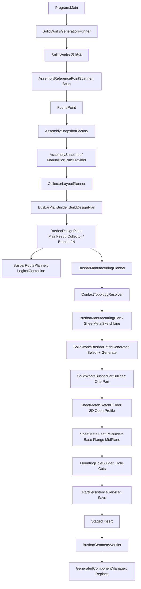

# 业务流程分析

本文档从业务逻辑角度说明当前铜排自动建模流程。当前程序只保留一条主流程：生成 ABC 三相转接排、ABC/N 汇流排、ABC/N 分支排，并按孔中心打孔装配。

## 1. 总体流程

```text
Program 读取命令行参数
↓
Cli.SolidWorksGenerationRunner 进入组合主线
↓
连接 / 激活 SolidWorks 装配体
↓
扫描装配体和组件参考点
↓
提取连接点 FoundPoint，并标准化为 AssemblySnapshot
↓
BusbarPlanningWorkflow 统一执行输入标准化、设计/制造规划和生成前预检
↓
SolidWorks 层生成 2D 开放轮廓草图
↓
Sheet Metal Base Flange MidPlane 生成钣金
↓
MountingHoleBuilder 孔切除
↓
SolidWorksBusbarPartBuilder 保存并暂存插入单根零件
↓
SolidWorksBusbarBatchGenerator 执行整批真实实体校验
↓
校验通过后替换旧组件，并由 Reporting 服务导出报表
```

## 2. 阶段输入输出

| 阶段 | 输入 | 输出 | 当前位置 |
| --- | --- | --- | --- |
| 命令行入口 | `args` | `GenerationOptions` | `Cli/GenerationOptionsParser.cs` |
| CLI 组合主线 | 运行开关、默认设置 | 完整生成流程 | `Cli/SolidWorksGenerationRunner.cs` |
| 装配体读取 | SolidWorks 会话 | `ModelDoc2`、`AssemblyDoc` | `SolidWorks/SolidWorksSession.cs` |
| 扫描阶段 | 装配体、组件 Transform | `FoundPoint` | `SolidWorks/AssemblyScanner.cs` |
| 点位提取 | `RefPoint` | 装配体坐标 `Point3` | `AssemblyScanner.TransformPoint` |
| 输入标准化 | 所有 `FoundPoint`、支持的电流规格 | `AssemblySnapshot` | `BusbarAutomation.Application/App/AssemblySnapshotFactory.cs` |
| 应用规划工作流 | 扫描点、工程配置 | `BusbarManufacturingPlan` + 预检报告 | `BusbarAutomation.Application/App/BusbarPlanningWorkflow.cs` |
| 端口生成 | 命名点、手动规则 | `ConnectionPort` | `Rules/ManualPortRuleProvider.cs` |
| 汇流排布局 | 端口、相序、设置 | `CollectorLayout` | `Planning/CollectorLayoutPlanner.cs` |
| 连接关系 | 设备端口、汇流排 Tap | `Busbar` | `BusbarPlanBuilder.CreateBusbar` |
| 拓扑判断 | 起终端口连接面 | 同侧/异侧 | `Planning/ContactTopologyResolver.cs` |
| 补偿计算 | 拓扑、厚度、端部裕度 | 钣金草图线 | `ContactTopologyResolver.CreateSheetMetalSketchLine` |
| 路径规划 | 起终点和规则 | 逻辑中心线 | `Planning/BusbarRoutePlanner.cs` |
| 制造规划 | `BusbarDesignPlan`、工程配置快照 | `BusbarManufacturingPlan` | `Planning/BusbarManufacturingPlanner.cs` |
| 草图生成 | 钣金草图线 | 2D Sketch | `SolidWorks/SheetMetalSketchBuilder.cs` |
| 钣金生成 | Sketch、宽度、厚度、R、K | Sheet Metal Feature | `SolidWorks/SheetMetalFeatureBuilder.cs` |
| 打孔 | `MountingPorts` | Cut Feature | `SolidWorks/MountingHoleBuilder.cs` |
| 保存装配 | 零件文档 | `SLDPRT`、装配组件 | `SolidWorks/PartPersistenceService.cs` |
| 单根零件建模 | 单根 `Busbar` 制造计划 | 暂存零件和组件 | `SolidWorks/BusbarPartBuilder.cs` |
| 批次生成 | 计划铜排、生成选项 | 已验证并替换的组件批次 | `SolidWorks/BusbarBatchGenerator.cs` |
| 实体校验 | 暂存/既有组件、计划 | 尺寸/孔贯穿/贴合报告 | `SolidWorks/BusbarGeometryVerifier.cs` |
| 组件替换 | 已通过暂存校验的新组件 | 清理后的装配体 | `SolidWorks/GeneratedComponentManager.cs` |
| 预检展示 | 结构化预检报告 | 控制台文本 | `Cli/PreflightConsolePresenter.cs` |
| 报表导出协调 | 制造计划、装配路径 | `Reports/*.xlsx` | `BusbarAutomation.Reporting/Reporting/ProductionReportService.cs` |

## 3. Mermaid 流程图


```mermaid
flowchart TD
    A["Program.Main"] --> B["SolidWorksGenerationRunner"]
    B --> C["SolidWorks 装配体"]
    C --> D["AssemblyReferencePointScanner: Scan"]
    D --> E["FoundPoint"]
    E --> F["AssemblySnapshotFactory"]
    F --> G["AssemblySnapshot / ManualPortRuleProvider"]
    G --> H["CollectorLayoutPlanner"]
    H --> I["BusbarPlanBuilder.BuildDesignPlan"]
    I --> J["BusbarDesignPlan: MainFeed / Collector / Branch / N"]
    J --> K["BusbarRoutePlanner: LogicalCenterline"]
    J --> L["BusbarManufacturingPlanner"]
    L --> M["ContactTopologyResolver"]
    M --> N["BusbarManufacturingPlan / SheetMetalSketchLine"]
    N --> O["SolidWorksBusbarBatchGenerator: Select + Generate"]
    O --> P0["SolidWorksBusbarPartBuilder: One Part"]
    P0 --> P1["SheetMetalSketchBuilder: 2D Open Profile"]
    P1 --> P["SheetMetalFeatureBuilder: Base Flange MidPlane"]
    P --> Q["MountingHoleBuilder: Hole Cuts"]
    Q --> R["PartPersistenceService: Save"]
    R --> S["Staged Insert"]
    S --> T["BusbarGeometryVerifier"]
    T --> U["GeneratedComponentManager: Replace"]
```

## 4. 业务规则摘要

- 铜排连接点按孔中心理解，不按实体边缘理解。
- 铜排端部裕度从孔中心向外延伸。
- 钣金宽度统一使用 SolidWorks 真正的 `MidPlane`，草图线就是宽度中心线。
- 同侧/异侧是拓扑关系，补偿只是当前建模阶段的应用结果。
- N 相当前只做汇流排和分支排，不做刀熔转接排。
- 折弯半径当前仍为默认固定值，后续应迁入 `BendRadiusRules` 或数据层。
- 螺栓长度已由 `FastenerPlanBuilder` 按标准件表计算；孔数、孔径和位置由搭接矩阵与 `BusbarOverlapHolePlanner` 负责。

## 5. 数据层接入点

当前 `数据层.xlsx` 还没有进入运行流程，但未来可以按下面方式接入：

```text
ExcelDataRepository
-> ComponentCatalog / BusbarCatalog / StandardPartCatalog
-> Rules
-> Planning
-> SolidWorks 渲染
```

这样 UI、Excel、SolidWorks、未来 UG 后端都围绕同一套业务模型和规则工作。

## 6. 2026-07 当前实测流程

当前规则中 400A/630A 的 ABC 默认双排夹接，250A 的 ABC 默认单排，N 排默认单排。双排漏保每相生成 `_Lower`、`_Upper` 两根分支排；搭接孔先由宽度矩阵规划为单孔、直双孔或斜双孔，再由 SolidWorks 层在真实实体表面完成贯穿切除。

Z-方向外侧 `_Upper` 从已错层起点出发，经过 Y+ 首段、Y+/Z- 斜向避让、Y+ 上升和 Z+ 回接；起终点和最终搭接高度保持不变。

双排夹接可只生成一个汇流排和一对分支排验证：

```powershell
TopToDown.exe --only=Busbar_A_Collector,Busbar_A_Branch_1_Lower,Busbar_A_Branch_1_Upper
```

不带 `--keep-existing` 时，新三件会先以临时名称插入并校验，通过后再替换旧 `Busbar_*` 组件。当前实测下排上表面贴合汇流排下表面，上排下表面贴合汇流排上表面；详细记录见 [docs/DOUBLE_CLAMP_IMPLEMENTATION_NOTES.md](docs/DOUBLE_CLAMP_IMPLEMENTATION_NOTES.md)。
